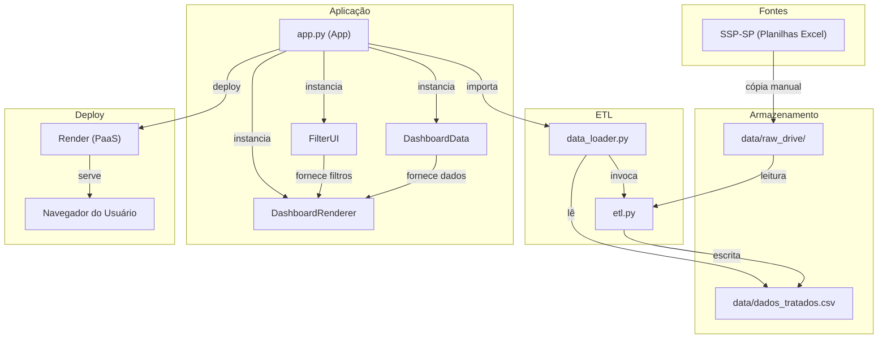
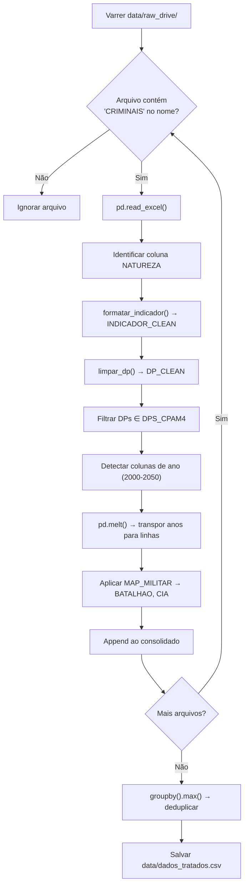
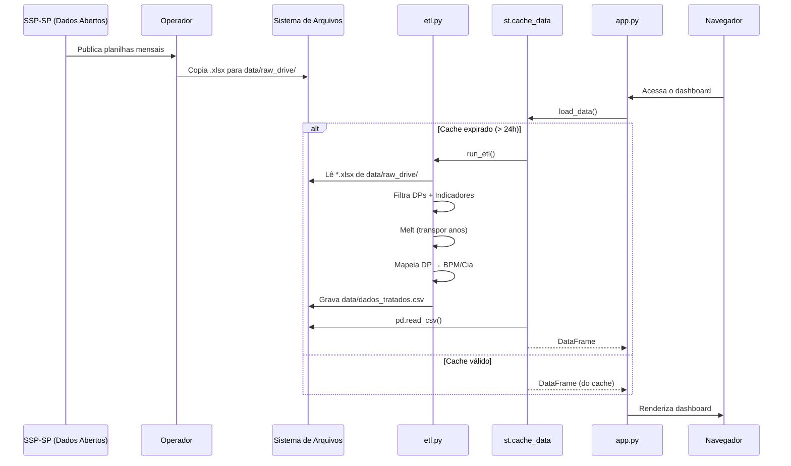
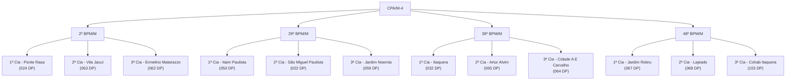

# Software Design Document (SDD) — Indicadores Criminais CPA/M-4

> Documento de Design de Software detalhado do Painel de Indicadores Criminais do CPA/M-4.
> Versão: 1.0 | Data: Julho 2026 | Autor: Renato Andrade

---

## 1. Introdução

### 1.1 Propósito

Este documento descreve a arquitetura, os componentes, o fluxo de dados e as decisões de design do **Painel de Indicadores Criminais CPA/M-4** — uma aplicação web de Business Intelligence (BI) construída em Python e Streamlit para monitoramento tático de indicadores de segurança pública na região Leste da cidade de São Paulo.

### 1.2 Escopo

O sistema abrange:
- **Ingestão** de planilhas Excel publicadas pela SSP-SP.
- **Transformação** (ETL) dos dados brutos em formato analítico normalizado.
- **Visualização** interativa via dashboard web com KPIs, tabelas comparativas, gráficos e diagnósticos automatizados.
- **Apresentação** autônoma em modo carrossel para uso em monitores de gabinete.

### 1.3 Definições e Acrônimos

| Sigla | Significado |
|---|---|
| CPA/M-4 | Comando de Policiamento de Área Metropolitana 4 |
| BPM/M | Batalhão de Polícia Militar Metropolitano |
| Cia | Companhia (subdivisão de um BPM) |
| DP | Delegacia de Polícia (circunscrição civil) |
| SSP-SP | Secretaria de Segurança Pública do Estado de São Paulo |
| ETL | Extract, Transform, Load |
| KPI | Key Performance Indicator |
| TTL | Time To Live (tempo de vida do cache) |

### 1.4 Público-alvo deste Documento

- Desenvolvedores que irão manter ou estender o sistema.
- Analistas de dados que precisam entender o pipeline.
- Gestores que desejam compreender a arquitetura sem ler código.

---

## 2. Visão Arquitetural

### 2.1 Estilo Arquitetural

O projeto segue uma **arquitetura monolítica em camadas**, adequada ao seu escopo (único desenvolvedor, dados de volume baixo, deploy PaaS).

```
┌─────────────────────────────────────────────────────────────┐
│                    CAMADA DE APRESENTAÇÃO                    │
│              app.py — Streamlit + Altair + CSS              │
│  ┌──────────┐  ┌──────────┐  ┌──────────────────────────┐  │
│  │ FilterUI │  │Dashboard │  │   DashboardRenderer      │  │
│  │ (sidebar)│  │   Data   │  │ (KPIs, tabelas, charts)  │  │
│  └──────────┘  └──────────┘  └──────────────────────────┘  │
├─────────────────────────────────────────────────────────────┤
│                   CAMADA DE DADOS / ETL                      │
│           data_loader.py  ←→  etl.py  ←→  Pandas            │
├─────────────────────────────────────────────────────────────┤
│                   CAMADA DE ARMAZENAMENTO                    │
│    data/raw_drive/*.xlsx  →  ETL  →  data/dados_tratados.csv│
└─────────────────────────────────────────────────────────────┘
```

### 2.2 Diagrama de Componentes



---

## 3. Decomposição de Módulos

### 3.1 Módulo `etl.py` — Pipeline de Extração e Transformação

**Responsabilidade:** Ler todas as planilhas Excel de dados criminais, filtrar as DPs alvo, padronizar indicadores, mapear para a hierarquia militar e consolidar em um CSV único.

#### 3.1.1 Constantes

| Constante | Tipo | Descrição |
|---|---|---|
| `DPS_CPAM4` | `list[str]` | Lista das 12 DPs sob jurisdição do CPA/M-4 |
| `MAP_MILITAR` | `dict[str, dict]` | Mapeamento DP → BPM/Cia (12 entradas) |

#### 3.1.2 Funções

| Função | Entrada | Saída | Descrição |
|---|---|---|---|
| `formatar_indicador(nat)` | `str` (natureza bruta) | `str \| None` | Padroniza nomes dos 6 indicadores, tratando problemas de encoding. Retorna `None` se não for indicador alvo. |
| `limpar_dp(dp_str)` | `str` (DP bruta) | `str \| None` | Extrai o código numérico via regex (`^\d{3}\s*DP`) e formata como `"XXX DP"`. |
| `map_mes(mes_val)` | `int \| str` | `str` | Converte número de mês (1-12) para nome em português ("Janeiro" a "Dezembro"). |
| `run_etl()` | — | `void` (grava CSV) | Pipeline principal. Detalhado abaixo. |

#### 3.1.3 Fluxo do `run_etl()`



#### 3.1.4 Esquema de Saída (CSV)

| Coluna | Tipo | Exemplo |
|---|---|---|
| `BATALHAO` | `str` | `"29º BPM/M"` |
| `CIA` | `str` | `"1ª Cia - Itaim Paulista"` |
| `INDICADOR` | `str` | `"FURTO OUTROS"` |
| `ANO` | `int` | `2026` |
| `MES` | `str` | `"Janeiro"` |
| `MES_INT` | `int` | `1` |
| `QUANTIDADE` | `int` | `213` |

---

### 3.2 Módulo `data_loader.py` — Carregamento com Cache

**Responsabilidade:** Invocar o ETL e carregar o CSV resultante com cache de 24 horas.

#### 3.2.1 Funções

| Função | Decorator | Descrição |
|---|---|---|
| `load_data()` | `@st.cache_data(ttl=86400)` | Executa `run_etl()`, lê o CSV e retorna o DataFrame. Cache expira a cada 24 horas. |
| `filter_data(df, ...)` | — | Função legada de filtragem (substituída por `DashboardData.filter_periodo`). |
| `calculate_variation(...)` | — | Função legada de cálculo (substituída por `DashboardData.calculate_variation`). |

#### 3.2.2 Estratégia de Cache

```
Requisição HTTP → Streamlit verifica cache
  ├── Cache válido (< 24h) → Retorna DataFrame do cache (< 1ms)
  └── Cache expirado (≥ 24h) → Executa run_etl() → Lê CSV → Armazena no cache
```

> **Nota:** As funções `filter_data` e `calculate_variation` estão presentes no módulo mas não são mais usadas pelo `app.py` atual, que migrou essa lógica para as classes `DashboardData` e `DashboardRenderer`. Representam código legado candidato a remoção.

---

### 3.3 Módulo `app.py` — Aplicação Principal

**Responsabilidade:** Orquestrar toda a interface do dashboard.

#### 3.3.1 Classe `DashboardData` (Model)

Encapsula os dados carregados e provê métodos de consulta e filtragem.

| Método | Descrição |
|---|---|
| `__init__(df)` | Ordena por ANO+MES_INT; extrai listas de anos, meses, indicadores; identifica o período mais recente. |
| `get_batalhoes()` | Retorna `["CPA/M-4 (Todos)"] + batalhões únicos ordenados`. |
| `get_cias(bpm)` | Retorna Cias filtradas por BPM (ou todas se "CPA/M-4 (Todos)"). |
| `get_mes_int(mes_nome)` | Traduz nome do mês → inteiro (ex.: "Março" → 3). |
| `get_mes_nome(mes_int)` | Traduz inteiro → nome do mês (ex.: 3 → "Março"). |
| `filter_periodo(bpm, cias, inds, ano, mes)` | Filtra DataFrame por todos os critérios de um período específico. |
| `filter_acumulado(bpm, cias, inds, ano, mes_max_int)` | Filtra DataFrame para acumulado (Jan até mês de referência). |
| `calculate_variation(current, prev)` | Calcula variação percentual entre dois valores. |

#### 3.3.2 Classe `FilterUI` (Controller)

Gerencia a sidebar interativa do Streamlit.

| Componente | Widget Streamlit | Descrição |
|---|---|---|
| Batalhão | `st.selectbox` | Seleção única (inclui opção "CPA/M-4 Todos") |
| Cia(s) | `st.multiselect` | Seleção múltipla, dinâmica conforme BPM selecionado |
| Indicadores | `st.multiselect` | Todos pré-selecionados por padrão |
| Ano/Mês (Atual) | `st.selectbox` × 2 | Defaults: último ano/mês disponível nos dados |
| Comparação | `st.radio` | "Mês Anterior", "Mesmo Mês Ano Anterior", "Personalizado" |
| Ano/Mês (Comp.) | `st.selectbox` × 2 | Calculado automaticamente ou selecionado manualmente |

**Saída:** Dicionário `filters` com 10 chaves usadas pelo `DashboardRenderer`.

#### 3.3.3 Classe `DashboardRenderer` (View)

Responsável por toda a renderização visual da tela principal.

| Método | Componente Visual | Biblioteca |
|---|---|---|
| `inject_css()` | Estilos globais (KPI cards, tabelas, cores) | HTML/CSS inline |
| `render_header()` | Cabeçalho com brasão em base64 | HTML inline |
| `render_kpis()` | 3 KPI cards (Total P1, Total P2, Variação %) | HTML inline |
| `render_tables()` | 2 tabelas HTML comparativas (Acumulado e Mensal) | HTML gerado |
| `render_bar_charts()` | Barras horizontais por localidade + Barras agrupadas por indicador | `st.bar_chart` + Altair |
| `render_diagnosis()` | Insights textuais automáticos (atenção/bons resultados) | Markdown |
| `render_pie_charts()` | Pizza por BPM ou por Cia com rótulos internos | Altair (`mark_arc + mark_text`) |
| `render_presentation_mode()` | Carrossel automático + iframe Google Slides | Altair + `st.components.v1.iframe` |

#### 3.3.4 Classe `App` (Facade)

Ponto de entrada (`if __name__ == "__main__"`). Orquestra a sequência de inicialização:

```python
App.run()
  ├── inject_css()
  ├── render_header() (inline no run)
  ├── load_data() → DashboardData
  ├── FilterUI.render() → filters dict
  └── DashboardRenderer
       ├── render_kpis()
       ├── render_tables()
       ├── render_bar_charts()
       ├── render_diagnosis()
       ├── render_pie_charts()
       └── render_presentation_mode()
```

---

### 3.4 Módulo `generate_mock_data.py` — Gerador de Dados Mockados

**Responsabilidade:** Criar um CSV de dados fictícios para desenvolvimento e testes sem depender das planilhas reais da SSP.

| Parâmetro | Valor |
|---|---|
| DPs geradas | 12 (todas as DPs do CPA/M-4) |
| Indicadores | 6 tipos |
| Período | 2023-2024, Janeiro-Junho |
| Seed | `np.random.seed(42)` (reprodutível) |
| Saída | `data/mock_criminais.csv` |

> **Nota:** O mock gera dados no schema antigo (coluna `DELEGACIA`), que é incompatível com o schema atual do ETL. Para uso em desenvolvimento, este script precisaria ser atualizado para gerar o schema atual (BATALHAO, CIA, INDICADOR, ANO, MES, MES_INT, QUANTIDADE).

---

## 4. Fluxo de Dados End-to-End



---

## 5. Modelo de Dados

### 5.1 Dados de Entrada (Planilhas SSP)

As planilhas da SSP possuem formato tabular com as seguintes colunas-chave:

| Coluna | Descrição |
|---|---|
| `DP` | Identificador da Delegacia (ex.: "022 DP - São Miguel Paulista") |
| `NATUREZA2` ou `AGRUPAMENTO_NATUREZA2` | Tipo de crime (texto livre com problemas de encoding) |
| `MES` | Mês como inteiro (1-12) |
| `2022`, `2023`, `2024`, ... | Colunas numéricas com quantidades por ano |

### 5.2 Dados de Saída (CSV Consolidado)

Após o ETL, cada linha representa: **uma combinação única de BPM + Cia + Indicador + Ano + Mês** com a respectiva quantidade.

```
BATALHAO, CIA, INDICADOR, ANO, MES, MES_INT, QUANTIDADE
```

- **Granularidade:** 1 linha por BPM/Cia/Indicador/Ano/Mês.
- **Cardinalidade atual:** ~4.500 linhas, ~244 KB.
- **Chave natural (deduplicação):** `(BATALHAO, CIA, INDICADOR, ANO, MES, MES_INT)`.
- **Estratégia de deduplicação:** `groupby(...).max()` — em caso de registros duplicados entre planilhas, preserva o maior valor.

### 5.3 Hierarquia Organizacional



---

## 6. Interface do Usuário

### 6.1 Layout Geral

```
┌──────────────────────────────────────────────────────────────────┐
│ [Brasão] Painel de Indicadores Criminais - CPA/M-4              │
│ Análise dos indicadores criminais da área do Comando...          │
├────────────┬─────────────────────────────────────────────────────┤
│  SIDEBAR   │  ÁREA PRINCIPAL                                     │
│            │                                                     │
│ ┌────────┐ │  ┌─────────┐ ┌─────────┐ ┌──────────┐             │
│ │Batalhão│ │  │ KPI #1  │ │ KPI #2  │ │ KPI #3   │             │
│ │Cia(s)  │ │  │ Total   │ │ Total   │ │ Variação │             │
│ │Indicad.│ │  │ Atual   │ │ Anterior│ │  (%)     │             │
│ │Ano/Mês │ │  └─────────┘ └─────────┘ └──────────┘             │
│ │Comparar│ │  ──────────────────────────────────────             │
│ └────────┘ │  ┌──────────────┐ ┌──────────────────┐             │
│            │  │ Tab Acumulado│ │ Tab Mês Espec.   │             │
│            │  └──────────────┘ └──────────────────┘             │
│            │  ──────────────────────────────────────             │
│            │  ┌──────────────┐ ┌──────────────────┐             │
│            │  │ Barras Horiz.│ │ Barras Agrupadas │             │
│            │  │ (Localidade) │ │ (Indicadores)    │             │
│            │  └──────────────┘ └──────────────────┘             │
│            │  ──────────────────────────────────────             │
│            │  💡 Diagnóstico Situacional                         │
│            │  ──────────────────────────────────────             │
│            │  🥧 Distribuição por BPM/Cia (Pizza)                │
│            │  ──────────────────────────────────────             │
│            │  📽️ Modo Apresentação (Carrossel)                   │
│            │  ──────────────────────────────────────             │
│            │  © Desenvolvido por Renato Andrade                  │
└────────────┴─────────────────────────────────────────────────────┘
```

### 6.2 Design Visual

| Aspecto | Implementação |
|---|---|
| **Background** | `#f0f2f6` (cinza claro Streamlit padrão) |
| **KPI Cards** | Fundo branco, `border-radius: 10px`, `box-shadow` sutil |
| **Variação positiva (crime subiu)** | Vermelho `#d32f2f` |
| **Variação negativa (crime caiu)** | Verde `#388e3c` |
| **Tabelas** | Fundo branco, bordas pretas `1px solid`, header cinza `#e0e0e0` |
| **Célula "aumento"** | `background-color: #ff0000`, texto branco |
| **Célula "queda"** | `background-color: #92d050` |
| **Cabeçalho** | Brasão CPA/M-4 em base64 + título H1 lado a lado |

> **Semântica invertida para segurança pública:** Vermelho = ruim (crime subiu); Verde = bom (crime caiu). Isso é o oposto da semântica financeira onde verde = lucro. A escolha é deliberada e documentada.

---

## 7. Regras de Negócio

### 7.1 Indicadores Monitorados

| Indicador | Descrição | Padrão de Detecção no ETL |
|---|---|---|
| FURTO OUTROS | Furtos exceto veículos | `"FURTO - OUTROS" in natureza` |
| FURTO VEÍCULO | Furto de veículos | `"FURTO DE VE" in natureza` |
| ROUBO OUTROS | Roubos exceto veículos e cargas | `"ROUBO - OUTROS" in natureza` |
| ROUBO VEÍCULO | Roubo de veículos | `"ROUBO DE VE" in natureza` |
| ROUBO DE CARGA | Roubo de cargas | `"ROUBO DE CARGA" in natureza` |
| HOMICÍDIO DOLOSO | Homicídios com dolo (excl. vítimas e trânsito) | `"HOMIC" AND "DOLOSO" in natureza, excl. "V" e "TR"` |

### 7.2 Cálculo de Variação Percentual

```
variação = ((valor_atual - valor_anterior) / valor_anterior) × 100

Caso especial:
  - Se valor_anterior == 0 e valor_atual > 0 → +100.0%
  - Se valor_anterior == 0 e valor_atual == 0 → 0.0%
```

### 7.3 Deduplicação de Dados

Quando múltiplas planilhas contêm dados para a mesma combinação `(BATALHAO, CIA, INDICADOR, ANO, MES, MES_INT)`, o ETL aplica `groupby().max()`, preservando o maior valor. Isso assume que valores maiores são correções/atualizações das fontes mais recentes.

### 7.4 Diagnóstico Situacional

O algoritmo analisa as variações de todos os indicadores selecionados:
- **Ponto de Atenção** (⚠️): indicador com a maior variação positiva (crime subiu).
- **Bons Resultados** (✅): indicador com a maior variação negativa (crime caiu).
- **Estabilidade**: exibido quando não há variações significativas.

---

## 8. Infraestrutura e Deploy

### 8.1 Ambiente de Desenvolvimento

| Requisito | Especificação |
|---|---|
| Python | ≥ 3.9 |
| Gerenciador de pacotes | pip |
| Ambiente virtual | `.venv/` (no `.gitignore`) |

### 8.2 Dependências

| Pacote | Uso | Declarado em `requirements.txt` |
|---|---|---|
| `streamlit` | Framework web completo | ✅ |
| `pandas` | ETL + manipulação de dados | ✅ |
| `plotly` | (importado no app, uso mínimo) | ✅ |
| `openpyxl` | Engine de leitura de .xlsx | ✅ |
| `gdown` | Download de arquivos do Google Drive | ✅ |
| `altair` | Gráficos avançados (barras agrupadas, pizza) | ✅ |

### 8.3 Ambiente de Produção (Render)

| Configuração | Valor |
|---|---|
| Plataforma | Render (Web Service) |
| Build Command | `pip install -r requirements.txt` |
| Start Command | `streamlit run app.py --server.port $PORT` |
| URL | `https://indicadores-criminais-m4.onrender.com` |
| Auto-deploy | Sim (push na branch `main`) |
| Tier | Free (cold start ~30s) |

### 8.4 Estrutura de Diretórios

```
indicadores_criminais_m4/
├── .agents/                     # Configuração de agentes AI
│   ├── memory/                  # Memória persistente do projeto
│   └── ...
├── .gitignore
├── .streamlit/
│   └── config.toml.bak         # Config Streamlit (backup)
├── app.py                       # Aplicação principal (~494 linhas)
├── brasao.png                   # Brasão do CPA/M-4 (577 KB)
├── data/
│   ├── raw_drive/               # Planilhas brutas SSP (gitignored)
│   │   ├── DADOS 2023/
│   │   ├── DADOS 2024/
│   │   ├── DADOS 2025/
│   │   └── DADOS 2026/          # 10 planilhas (5 criminais + 5 produtividade)
│   ├── dados_tratados.csv       # Saída do ETL (~244 KB)
│   └── mock_criminais.csv       # Dados mockados para dev (~46 KB)
├── data_loader.py               # Carregamento com cache
├── docs/
│   ├── ADR.md                   # Architecture Decision Records
│   ├── DOCUMENTACAO.md          # Documentação funcional
│   └── SDD.md                   # Este documento
├── etl.py                       # Pipeline de transformação
├── generate_mock_data.py        # Gerador de dados fictícios
├── README.md                    # Documentação pública (GitHub)
└── requirements.txt             # Dependências Python
```

---

## 9. Segurança e Privacidade

| Aspecto | Abordagem |
|---|---|
| **Dados sensíveis** | O projeto utiliza exclusivamente **dados abertos públicos** da SSP-SP. Não há dados pessoais, dados policiais sigilosos ou informações de investigação. |
| **Autenticação** | Não implementada atualmente. O dashboard é público. |
| **Secrets** | Nenhum segredo ou API key é utilizado. |
| **Dados no Git** | Planilhas brutas estão no `.gitignore`. Apenas o CSV processado (dados públicos) é versionado. |
| **Injeção HTML** | O uso de `unsafe_allow_html=True` é restrito a componentes visuais estáticos (CSS, tabelas, cabeçalho). Não há input do usuário renderizado como HTML. |

---

## 10. Limitações Conhecidas e Dívida Técnica

| Item | Descrição | Severidade | ADR Relacionado |
|---|---|---|---|
| **Código legado em `data_loader.py`** | Funções `filter_data()` e `calculate_variation()` não são mais usadas pelo `app.py` | 🟢 Baixa | — |
| **Mock desatualizado** | `generate_mock_data.py` gera schema antigo (DELEGACIA) incompatível com o ETL atual | 🟡 Média | — |
| **`DashboardRenderer` grande** | Classe com ~250 linhas e 7 métodos de renderização. Candidata a decomposição. | 🟢 Baixa | ADR-007 |
| **`render_header()` duplicado** | O cabeçalho é renderizado tanto em `DashboardRenderer.render_header()` quanto diretamente no `App.run()`. | 🟡 Média | — |
| **`time.sleep()` no carrossel** | Bloqueia o thread Streamlit durante a apresentação. | 🟡 Média | ADR-001 |
| **Altair não declarado** | Dependência transitiva, sem pin de versão explícito. | 🟢 Baixa | ADR-004 |
| **Planilhas de PRODUTIVIDADE** | Existem nos dados brutos mas não são processadas pelo ETL. | 🟡 Média | ADR-012 |
| **Sem testes automatizados** | Nenhum teste unitário ou de integração. | 🔴 Alta | — |

---

## 11. Evolução Planejada

| Prioridade | Evolução | Impacto |
|---|---|---|
| 🔴 Alta | Testes unitários para `etl.py` e `DashboardData` | Confiabilidade |
| 🟡 Média | Ingestão automatizada das planilhas SSP (ADR-011) | Operacional |
| 🟡 Média | Processamento das planilhas de PRODUTIVIDADE (ADR-012) | Funcionalidade |
| 🟡 Média | Autenticação básica via `st.secrets` (ADR-010) | Segurança |
| 🟢 Baixa | Migração para DuckDB (ADR-009) | Escalabilidade |
| 🟢 Baixa | Remoção de código legado em `data_loader.py` | Manutenção |
| 🟢 Baixa | Atualização do `generate_mock_data.py` para schema atual | DX |

---

*Última atualização: Julho de 2026*
